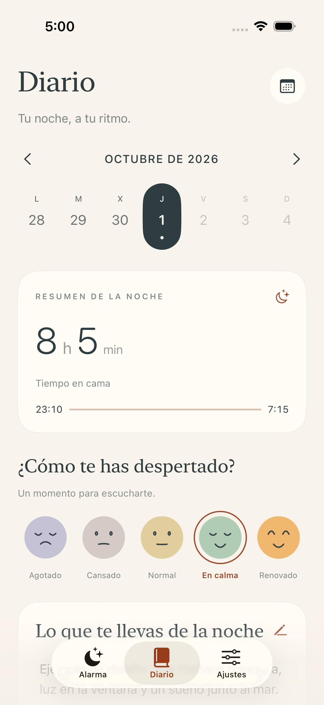
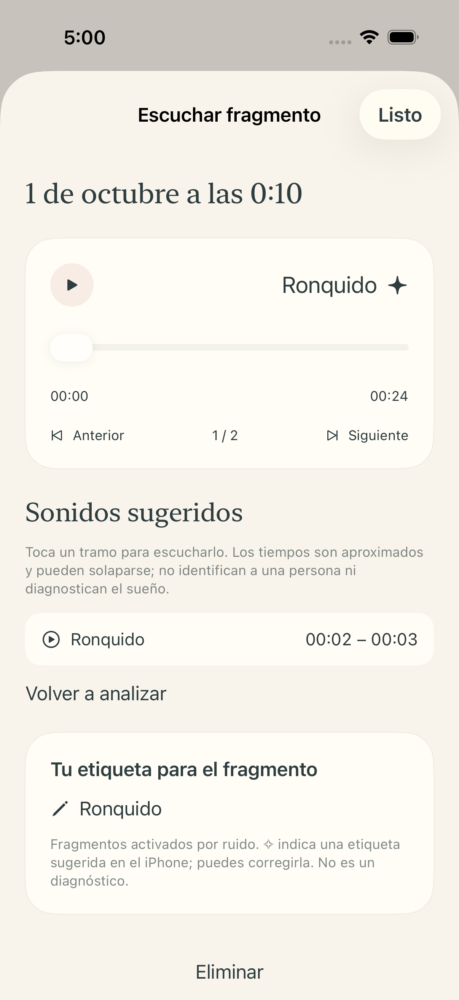
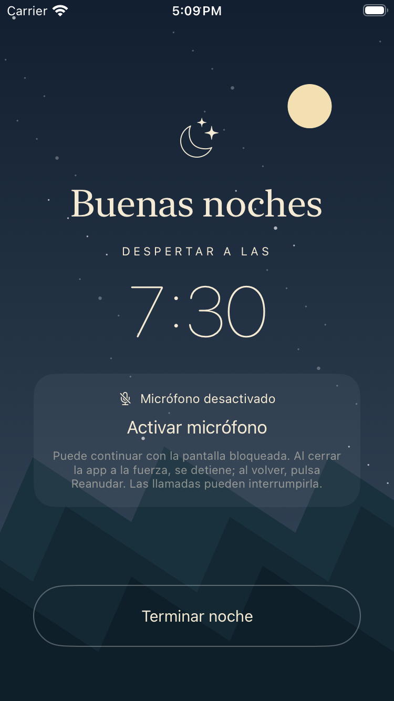

# Alarma — candidata nativa 1.1 (1)

SwiftUI para iPhone, iOS 16+, castellano e inglés. Se conserva el diseño
aprobado: papel cálido, tinta oscura, acentos teja y títulos serif.
El sistema nuevo reside en `sleep-next`; los proyectos anteriores se conservan
como referencia. El diario permite calendario, notas, ánimo, clips y fases de
Salud disponibles. El detalle de sonido añade reproducción, búsqueda, navegación,
intervalos, corrección manual, reanálisis y borrado confirmado.

## Validación de esta candidata

[Xcode CI correcta](https://github.com/Krazel/Alarmy/actions/runs/36894350167),
fuente `f9bfe70d0b6a3e5bf33a6136fe619765ed50fc44`: **50 pruebas unitarias e
integración y 6 UI**, cero fallos. El flujo nocturno se repite en iPhone SE de
tercera generación: 57 ejecuciones, 56 pruebas únicas. Release iPhone correcto.
El binario incorpora mínimo iOS 16, enlace opcional de AlarmKit, ES/EN y audio
en segundo plano, sin corpus ni mecanismos de Debug: `package-check.json`.

El usuario ha solicitado pasar directamente a TestFlight el 1 de octubre.
La subida se completó el **2 de octubre de 2026** con
[CI de TestFlight correcta](https://github.com/Krazel/Alarmy/actions/runs/36932912801),
reutilizando el código validado sin repetir pruebas. La ficha inicial está
creada como [Alarma de Krazel](https://appstoreconnect.apple.com/apps/6818287946),
App ID 6818287946, y releída por la API oficial: `app-record.json`.
El nombre «Alarma» estaba ocupado en Apple; el nombre del iPhone sigue siendo Alarma.
Cerebro confirmó el procedimiento existente después de terminar su tarea.
El titular autorizó expresamente el perfil App Store y los secretos temporales
el 2 de octubre. La build **1.1 (1)** está procesada (`VALID`) y disponible
en pruebas internas (`IN_BETA_TESTING`) para el titular como único tester,
con notas es-ES/en-US y sin enlace público: `testflight-verified.json`.
`upload.json` conserva el SHA de fuente y del IPA aceptado por Apple.
Los ocho secretos temporales del entorno GitHub `alarma-local-qa` se eliminaron
y se releyó el entorno vacío: `credentials-cleanup.json`. Los originales locales
se conservan. Instalación, noche física y batería pendientes. App Store solo
tiene la ficha creada; no se ha enviado a revisión ni publicado.

Apple rechazó el primer upload (36932439359) por familia iPad no deseada (90474)
y texto de Salud ausente (90683). `35a7c56` cambia solo cuatro archivos de
metadatos: familia iPhone en el target y NSHealthUpdateUsageDescription ES/EN,
aclarando que esta versión no solicita escritura en Salud. El workflow verifica
que el código, assets y pruebas siguen iguales a f9bfe70; comprueba el paquete
firmado antes de subirlo. No se amplió la batería de pruebas.

## Diseño nativo implementado

Capturas XCTest de iPhone 17 Pro y SE (iOS 26). La sesión y las etiquetas de
ejemplo son fixtures de Debug excluidos de Release, no una noche medida.

## Reconocimiento con audio real

El banco contiene 22 grabaciones públicas CC0 de 22 autores, con procedencia,
licencia y SHA-256 en `sleep-next/Tests/Corpus/manifest.json`. Solo forma parte
del bundle de pruebas. El ejecutable de producción usa SoundAnalysis de Apple
en el dispositivo; no envía el audio a un servicio.

Se evalúan las mismas fuentes en limpio, con ganancia de −18 dB y mezcladas
con un ventilador real a SNR nominal de 10 dB: 66 casos derivados, no 66
grabaciones independientes. Se distinguen 9 fuentes de desarrollo y 13 de
validación. Los resultados de validación ya se han visto durante las
iteraciones: la evaluación final es repetida, no una prueba ciega. Las etiquetas
proceden de sus autores y algunos sonidos son actuados; no son datos clínicos
ni una noche real de sueño.

`recognition-report.py` reproduce matrices de confusión, precisión y recall
por clase y por condición a partir del adjunto XCTest exportado. «Otro» es
abstención, no una clase entrenada de todos los ruidos. El umbral 0,65 representa
la puntuación del modelo, no un porcentaje de aciertos. Las métricas dominantes
por fuente tampoco certifican todos sus intervalos. Se incluyen por separado
los clips generados por el detector y escritor reales.

## TestFlight y prueba pendiente

La preparación USB queda como antecedente; no se ha generado un IPA firmado
ad hoc ni se ha instalado en el teléfono. El objetivo actual es TestFlight.
La automatización exportó para App Store, envió a Apple y guardó solo
un manifiesto de subida como artifact público. Las credenciales, perfiles,
claves y audio personal quedan fuera de Git. Debe distinguirse la aceptación
de la subida, el procesamiento y la disponibilidad interna o externa.

El [protocolo físico](PROTOCOL.md) queda disponible para usar desde TestFlight,
sin ampliar ni bloquear la entrega con nuevas comprobaciones automáticas.
Basta compartir resultados resumidos, conservando el audio personal en el iPhone.

AlarmKit se usa desde iOS 26. iOS 16–25 conserva notificaciones locales, cuyos
sonidos dependen de los ajustes del sistema. Compilar con mínimo iOS 16 y
comprobar el enlace opcional de AlarmKit no sustituye probar esa ruta en un
iPhone con iOS anterior. Quedan por medir el consumo de batería, captura con
pantalla bloqueada durante una noche y comportamiento con llamadas/rutas.

La captura tiene límites de 256 MiB por noche y 512 MiB totales. Con muchos
eventos largos puede detenerse antes de acabar; la interfaz conserva las
pausas y errores. La simulación de ocho horas prueba el detector, sin acreditar
la autonomía ni una noche física.
