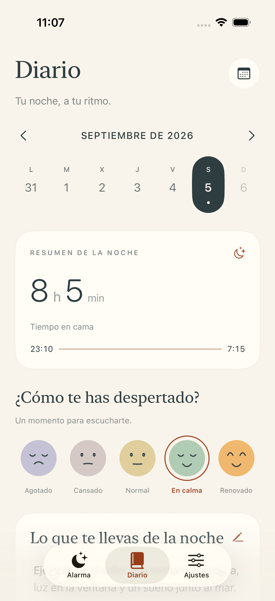
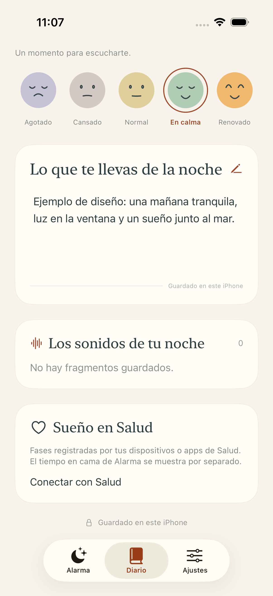
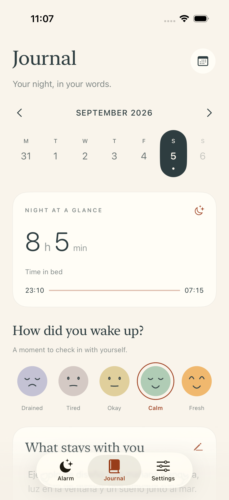
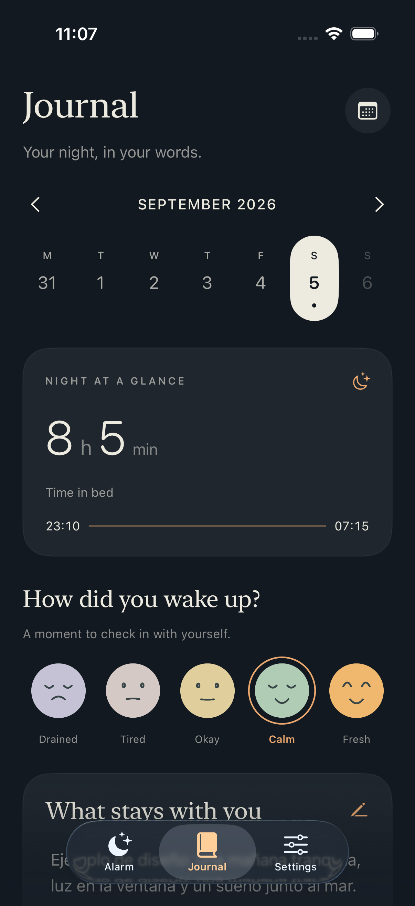
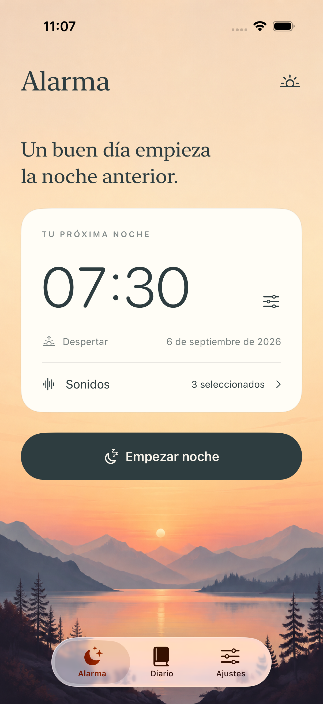
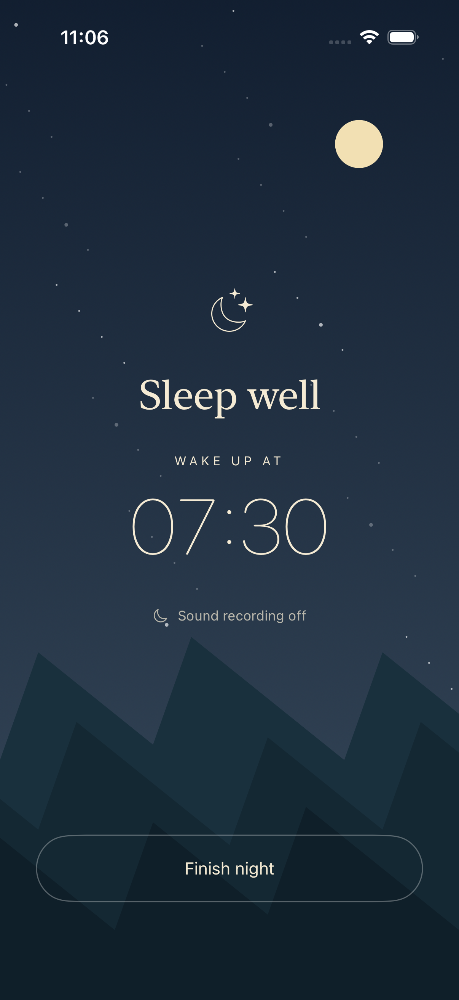

# Diario del sueño — capturas de la app nativa

Diseño implementado en SwiftUI. Capturas del iPhone 17 Pro simulado (iOS 26.4.1), código `6035291`, [20 pruebas superadas](../VALIDATION.md). La sesión de 8 h 5 min y las notas son ejemplos de diseño. Cambiar el idioma traduce la interfaz y conserva el texto escrito por la persona.

## Diario en castellano

## Notas, sonidos y Salud

## Diario en inglés y modo oscuro

## Alarma y noche

[Autoría, generación de recursos y prompt de la ilustración](ASSETS.md).
